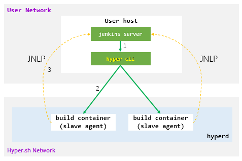

Hyper.sh Slaves Plugin For Jenkins
==================================

This plugin allows to execute a jenkins job inside [`Hyper.sh`](https://hyper.sh) container(s).

<!-- TOC depthFrom:1 depthTo:6 withLinks:1 updateOnSave:1 orderedList:0 -->

- [Architecture](#architecture)
- [Dependency](#dependency)
- [About Image](#about-image)
- [Usage](#usage)
	- [Config](#config)
		- [Enable JNLP](#enable-jnlp)
		- [hyper-commons-plugin Configuration](#hyper-commons-plugin-configuration)
		- [Job Configuration](#job-configuration)
	- [Start Build](#start-build)
	- [View Log](#view-log)
		- [View Build Result](#view-build-result)
		- [View Slave node log](#view-slave-node-log)
		- [View build container](#view-build-container)
	- [Debug](#debug)
		- [Example](#example)

<!-- /TOC -->

# Architecture


# Dependency
- [docker-slaves-plugin](https://github.com/jenkinsci/docker-slaves-plugin)
- [hyper-commons-plugin](https://github.com/jenkinsci/hyper-commons-plugin)
- Hyper.sh credential (get from https://console.hyper.sh)
- Jenkins Server should have `public ip`
- [trampoline](trampoline/README.md)

# About Image

You can specify customized build image, but it should contain `java` and `wget`/`curl`
- `java`(required): run slave agent(slave.jar) to connect Jenkins master through JNLP.
- `wget`/`curl`(optional): download slave.jar from jenkins master. This ensures that slave agent version matched with the master. Download will be skipped when wget/curl is missing.

Several recommend base images:
- openjdk:8-jdk
- jenkinsci/slave
- hyperhq/jenkins-slave-golang

# Usage

## Config

### Enable JNLP
```
Manage Jenkins -> Configure Global Security
  -> Enable security: checked
  -> TCP port for JNLP agents: Fixed 5000
```


### hyper-commons-plugin Configuration
```
Manage Jenkins -> Configure System -> Hyper Config
  -> Access Key
  -> Secret Key

Manage Jenkins -> Configure System -> Hypercli Install
  -> Download Hypercli
```


### Job Configuration

Select build image(`Recommended Container Size: >=S2` )  


Add build step  


## Start Build
Click `Build Now`  


## View Log

### View Build Result


### View Slave node log


### View build container


## Debug

If job failed, please check the following log:  
- Check the “Console Output” in “Build history” of Job
- Check the Node log
- Check the Hyper.sh container log by execute “hyper logs <container_id>”

### Example

Check the `Consle Output`  


Then check the Node log(`this will be deleted after job finished`)  


The cause maybe Hyper.sh container size is too small, or slave agent start failed.

You can check the Hyper.sh container log like this:  

